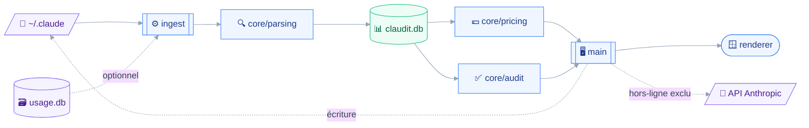

# INSTALL — claudit

## 🎯 Vision

Le tableau de bord qui rend la configuration de Claude Code visible, auditable et rentable — sans éditer un seul fichier à la main.

claudit remplace l'édition manuelle des fichiers de `~/.claude` par une interface unique.
Il mesure la consommation réelle de tokens et la convertit en coût API équivalent, ce qui répond à une question qu'aucun outil ne traite : un abonnement forfaitaire est-il rentable face à la facturation à l'usage.
Il audite ensuite skills, agents et prompts contre les bonnes pratiques, puis croise la qualité des résultats avec leur coût pour désigner ce qui mérite d'être optimisé.

Le projet est un side project personnel, open source et sans enjeu commercial.
Sa cible est son auteur, puis quelques développeurs amis.

## ⚖️ Décisions

| Décision | Choix | Pourquoi |
| --- | --- | --- |
| Architecture | Monolithe à noyau isolé | Un seul mainteneur, quatre fonctionnalités, aucun temps réel. La scission en paquets a été auditée puis écartée comme prématurée |
| Front-end | React + Vite, SPA | Tableau de bord interactif, aucun besoin de SEO ni de rendu serveur |
| Back-end | TypeScript — processus principal Electron + processus utilitaire | Seul langage maîtrisé. Rust exclu de fait, donc Tauri écarté |
| Base de données | SQLite locale | 210 k enregistrements, pire agrégat mesuré à 85 ms. Tout reste sur la machine |
| Authentification | Sans objet | Application locale mono-utilisateur |
| Hébergement | Sans objet | Distribution par GitHub Releases et tap Homebrew personnel, sans signature |

### Le noyau isolé

`src/core/` ne contient que du TypeScript pur : parsing, règles d'audit, scoring, calcul de coût.
Il n'importe ni `electron` ni `node:fs`, et la frontière est tenue par une règle Biome plutôt que par une scission en paquets.

```json
{ "overrides": [{
    "includes": ["src/core/**/*.ts"],
    "linter": { "rules": { "style": { "noRestrictedImports": {
      "level": "error",
      "options": { "paths": { "electron": "core doit rester agnostique." } }
    }}}}
}]}
```

Cette frontière garde ouverte l'option d'un CLI publiable via `bin` et `files`, sans en payer le coût aujourd'hui.
Le CLI est explicitement classé comme besoin spéculatif.

## 🛠️ Synthèse de la pile

- **Front-end :** React + Vite, dans le renderer Electron
- **Back-end :** TypeScript, Node ≥ 22 — `better-sqlite3@13` segfault sous Node 20, en fin de vie depuis avril 2026
- **Base de données :** SQLite locale (`claudit.db`). Le moteur reste à trancher entre `node:sqlite` et `better-sqlite3@13`
- **Empaquetage :** `electron-builder` + `electron-vite`. Electron Forge écarté — son plugin Vite est estampillé expérimental et son gabarit reste en Vite 5, incompatible avec Vitest 4 qui exige Vite ≥ 6
- **Outillage :** Biome pour le lint et le format, Vitest 4 pour les tests
- **Intégrations :** fichiers de `~/.claude` en lecture et écriture · transcripts JSONL · grille tarifaire Anthropic versionnée · API Anthropic pour les recommandations · `usage.db` en lecture optionnelle

### Le choix du moteur SQLite reste ouvert

Aucune des deux options n'est confortable, et l'arbitrage se fera au premier jet d'implémentation.

| | `node:sqlite` | `better-sqlite3@13.0.3` |
| --- | --- | --- |
| Binaire natif | Aucun | N-API, 8 prébuilds, 27 Mo installés |
| Maturité | Release candidate depuis deux ans, jamais stabilisée | Passé en N-API le 2026-07-21, soit cinq semaines |
| Mesuré sous charge | Non | Oui — 6,5 s sur 1,6 Go |

Les deux API sont proches : `node:sqlite` a été modelée sur `better-sqlite3`.
Un adaptateur mince dans `src/main/db/` rend le basculement peu coûteux, et c'est la raison pour laquelle la décision peut attendre.

## 🏗️ Architecture

Le diagramme montre le trajet d'une donnée, de sa source dans `~/.claude` jusqu'à son affichage, en passant par l'ingestion et le noyau.



L'ingestion vit dans un **processus utilitaire Electron**, jamais dans le processus principal.
Ce choix sort l'API SQLite synchrone du fil de l'interface, et il contourne une lacune connue : Vite ne sait pas encore empaqueter un worker Node, la PR amont étant ouverte depuis novembre 2025.
Le noyau ne connaît ni Electron ni le système de fichiers ; c'est `src/main/config/` qui lit et écrit `~/.claude`, et `src/main/recommend/` qui parle à l'API.

### Chargement paresseux, coquille d'abord

La coquille de l'application doit être interactive en moins de trois secondes, quoi qu'il arrive.
L'indexation tourne en arrière-plan sans jamais bloquer l'interface, et toute vue doit savoir s'afficher dans un état de données partielles.
C'est une contrainte de conception, pas une optimisation à ajouter plus tard.

## 📁 Arborescence

```txt
claudit/
├── biome.json                   # lint + format, incl. la frontière du noyau
├── electron-builder.yml         # cibles macOS / Windows / Linux
├── electron.vite.config.ts
├── vitest.config.ts
├── package.json                 # bin + files prêts si le CLI arrive un jour
├── tsconfig.json
├── aidd_docs/
│   └── INSTALL.md
├── resources/
│   └── icon.png
└── src/
    ├── core/                    # TS pur — aucun import electron ni node:fs
    │   ├── parsing/             # JSONL → enregistrements normalisés
    │   ├── pricing/             # grille tarifaire versionnée, équivalence API
    │   ├── audit/               # règles, front-matter, adéquation du modèle
    │   ├── scoring/             # qualité heuristique locale
    │   └── index.ts
    ├── ingest/                  # processus utilitaire — scan et ingestion
    │   └── index.ts
    ├── main/                    # processus principal Electron
    │   ├── db/                  # schéma, migrations, adaptateur SQLite
    │   ├── config/              # lecture et écriture de ~/.claude
    │   ├── recommend/           # appels API Anthropic, désactivés hors ligne
    │   ├── ipc/
    │   └── index.ts
    ├── preload/
    │   └── index.ts
    └── renderer/                # React
        ├── features/
        │   ├── dashboard/
        │   ├── editor/          # pilier éditer
        │   ├── costs/           # pilier mesurer
        │   ├── audit/           # pilier auditer
        │   └── optimize/        # pilier optimiser
        ├── components/
        └── main.tsx
```

## 🚀 Étapes d'installation

Installation manuelle : le framework ne génère pas encore ces éléments automatiquement.

1. Vérifier que Node ≥ 22 est actif — `better-sqlite3@13` segfault sous Node 20.
2. Initialiser le dépôt git et le `package.json`, avec `electron` en `devDependencies` : `electron-builder` refuse de construire autrement.
3. Installer la pile de développement — `electron`, `electron-builder`, `electron-vite`, `vite`, `react`, `@biomejs/biome`, `vitest`.
4. Créer `biome.json` avec l'override `src/core/**` décrit plus haut, puis vérifier que la règle mord réellement par un import fautif volontaire.
5. Décider du moteur SQLite après un jet de mesure sur le corpus réel, et l'isoler derrière l'adaptateur `src/main/db/`.
6. Écrire le schéma SQLite et la première passe d'ingestion dans le processus utilitaire, avec `journal_mode=WAL`, `synchronous=NORMAL`, des transactions par lots et la création des index après ingestion.
7. Préparer la clé API Anthropic en variable d'environnement, optionnelle, et vérifier que l'application démarre sans elle.

## ⚠️ Contraintes connues

### La distribution macOS est bloquée sans signature

Deux verrous indépendants tombent sur la même cause, l'absence de Developer ID.
Homebrew désactive les casks échouant aux contrôles Gatekeeper à partir de septembre 2026, et `Squirrel.Mac` exige une application signée pour que la mise à jour automatique fonctionne, sans exception.

La décision prise est d'assumer l'absence de signature pour l'instant.

| Conséquence | Traitement retenu |
| --- | --- |
| Pas de cask officiel | Tap Homebrew personnel |
| Pas de mise à jour automatique sur macOS | L'application notifie qu'une version existe, elle ne l'installe pas |
| Avertissement Gatekeeper à chaque version | Étape `xattr -dr com.apple.quarantine` documentée pour l'utilisateur |
| Windows | Conserve sa mise à jour automatique, un avertissement SmartScreen près |

Le déblocage coûte 99 $/an via l'Apple Developer Program, à reconsidérer au premier partage large.

### `usage.db` est une source tierce, jamais une source de vérité

Le fichier appartient à un outil tiers nommé Claude Usage.
Son `schema_meta` ne porte aucun numéro de version, sa table `agents` est vide, et son `journal_mode` vaut `delete` — donc un journal chaud laissé par un plantage de l'autre outil empêche toute ouverture en lecture seule.

Il est traité comme un accélérateur optionnel, avec introspection `PRAGMA table_info` à chaque ouverture et échec silencieux toléré.
Les transcripts JSONL restent la source primaire.

### Le calcul de coût est à sept dimensions

Un simple produit entrée fois prix, plus sortie fois prix, donnerait un chiffre faux.
Le champ `usage` d'une ligne `assistant` distingue le cache une heure du cache cinq minutes, deux tarifs d'écriture différents, isole les tokens de réflexion, compte séparément les requêtes d'outils serveur, et porte un `service_tier` qui conditionne la grille.

La grille tarifaire doit donc être un modèle versionné dans le temps, puisque les tarifs évoluent.

### La surface d'édition dépasse `~/.claude`

Chez l'auteur, `~/.claude/agents/`, `rules/` et `skills/` sont vides : les skills et agents réels vivent dans `~/.claude/plugins/`.
Le pilier éditer doit couvrir les deux emplacements, sans quoi il n'afficherait rien.

## 🔍 Synthèse de l'audit

Trois agents ont audité les candidats en parallèle, chacun mesurant sur la machine réelle plutôt qu'en estimant.
Deux d'entre eux ont installé Electron 44 et exécuté du code.

| Candidat | Verdict | Note |
| --- | --- | --- |
| A — Monolithe direct | ⚠️ | Pile saine, aucun problème d'intégration. 1,6 Go ingérés en 6,46 s, agrégat à 40 ms. Seul blocage : la distribution, indépendante du stack |
| B — Moteur analytique DuckDB | ❌ | `read_json_auto` fait crasher Electron en SIGTRAP sur les 2 303 fichiers, aucun ticket amont. Le contournement supprime la raison d'être et perd 27 colonnes en silence |
| C — Cœur headless réutilisable | ⚠️ | Le conflit d'ABI n'existe plus, `better-sqlite3@13` étant en N-API. Mais la scission en paquets n'apporte rien au jour 1 et importe des pannes réelles |

Le candidat retenu est **A**, augmenté de la discipline de frontière proposée par **C**, sans sa scission en paquets.

### Ce que les mesures ont corrigé

| Hypothèse de départ | Mesure |
| --- | --- |
| Première indexation en plusieurs minutes | 6,46 s en mono-thread |
| `worker_threads` indispensable pour tenir le budget | Confort, pas nécessité — le processus utilitaire suffit |
| Homebrew comme repli à la mise à jour automatique | Repli invalide, les deux canaux se ferment ensemble |
| DuckDB pertinent pour l'analytique | Gain réel à partir de 10 M de lignes, le projet en a 210 k |

### Réserves non levées

- Le comportement de `node:sqlite` sous charge, sur 1,6 Go, n'a pas été mesuré.
- Le crash DuckDB n'a été reproduit que sur macOS arm64 avec Electron 44.
- La syntaxe exacte des `overrides` Biome a été lue dans la documentation, jamais exécutée.
- Le diagramme Mermaid ci-dessus n'a pas été soumis à un rendu.
