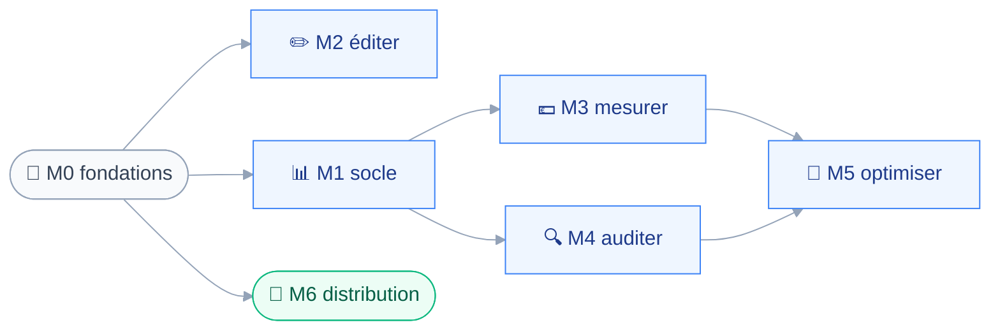

# ROADMAP — claudit

## 🧭 Comment la lire

Sept jalons, ordonnés par leurs dépendances et non par une date.
Aucune ligne ci-dessous n'existe sur le disque : le dépôt ne contient encore ni `package.json` ni `src/`.

Chaque jalon porte des artifacts au sens de `memory/backlog.md` — `Task`, `Feature`, `Spike`.
Ce document fixe l'ordre et les preuves attendues ; les issues GitHub, elles, portent le périmètre et les critères.

Un jalon est terminé quand toutes ses preuves sont vérifiées, pas quand son code est écrit.

## 🔗 Chaîne de dépendances

Le diagramme montre quel jalon débloque quel autre, et pourquoi le pilier éditer passe avant le socle de données.

`M2` ne consomme pas la base : il lit et écrit directement les fichiers de configuration.
C'est le seul pilier livrable sans ingestion, donc le premier écran utile du projet.

`M6` se détache du reste dès `M0` : il n'attend aucun pilier, seulement une application qui démarre.

## 🧱 M0 · Fondations

| Type | Travail | Preuve |
| --- | --- | --- |
| Task | Scaffold `electron-vite`, React, TypeScript | La fenêtre s'ouvre |
| Task | `biome.json` et override `src/core/**` | Un import fautif est rejeté |
| Task | Portes `tsc --noEmit` puis `vitest run` | Les deux commandes passent |
| Task | Coquille trois processus, routeur, styles | Interactive sous trois secondes |

Le routeur et la méthode de style se tranchent ici, pas plus tard : ils bloquent tout le renderer.
La frontière du noyau se prouve par un import `electron` fautif volontaire, sinon rien n'atteste que la règle mord.

## 📊 M1 · Socle de données

| Type | Travail | Preuve |
| --- | --- | --- |
| Spike | Moteur SQLite tranché sur mesure réelle | Durées relevées sur le corpus |
| Task | Adaptateur `src/main/db/`, schéma, migrations | Migrations rejouables |
| Feature | `core/parsing` des transcripts JSONL | Tests sans Electron ni disque |
| Feature | Ingestion en processus utilitaire | Corpus ingéré, durée mesurée |

Le Spike lève la réserve de `memory/database.md` : `node:sqlite` n'a jamais été mesuré sous charge.
Il tranche avant l'adaptateur, mais l'adaptateur reste mince pour que le verdict reste réversible.

## ✏️ M2 · Pilier éditer

| Type | Travail | Preuve |
| --- | --- | --- |
| Task | Bibliothèque de formulaires et de validation | Choix consigné dans `forms.md` |
| Feature | Lecture des deux emplacements de configuration | Les skills réels s'affichent |
| Feature | Écriture validée des fichiers | Un contenu invalide est refusé |

> [!IMPORTANT]
> Un pilier qui ne lit que `~/.claude` affiche un écran vide : les skills et agents réels vivent dans `~/.claude/plugins/`.
> Les deux emplacements sont un critère d'acceptation, pas une amélioration ultérieure.

## 💶 M3 · Pilier mesurer

| Type | Travail | Preuve |
| --- | --- | --- |
| Feature | `core/pricing`, grille versionnée dans le temps | Un ancien enregistrement se retarife |
| Feature | Sept dimensions et `service_tier` | Tests sur un transcript réel |
| Feature | Vue coûts, forfait contre usage | L'équivalence s'affiche |

> [!WARNING]
> Une erreur de tarification produit un chiffre plausible et faux, jamais un plantage.
> Les tests unitaires précèdent l'écran, sans exception.

## 🔍 M4 · Pilier auditer

| Type | Travail | Preuve |
| --- | --- | --- |
| Feature | `core/audit`, règles et front-matter | Règles testées sans disque |
| Feature | `core/scoring`, qualité heuristique locale | Score reproductible |
| Feature | Vue audit | Écarts listés par unité |

L'adéquation du modèle fait partie des règles, pas d'un jalon séparé.

## 🎯 M5 · Pilier optimiser

| Type | Travail | Preuve |
| --- | --- | --- |
| Feature | `src/main/recommend/`, clé API optionnelle | L'application démarre sans clé |
| Feature | Blocage hors ligne | Aucun appel réseau émis |
| Feature | Croisement qualité et coût | Classement affiché |

Ce jalon est le seul à dépendre de deux piliers : sans `M3` ni `M4`, il n'a rien à croiser.

## 🚚 M6 · Distribution

| Type | Travail | Preuve |
| --- | --- | --- |
| Task | `electron-builder.yml`, trois cibles | Trois artefacts produits |
| Task | Workflow GitHub Actions sur tag | Une release publiée |
| Task | Tap Homebrew et procédure `xattr` | Installation documentée |
| Task | Notification de version sur macOS | Aucune installation automatique |

La signature de code reste absente, et ses conséquences sont assumées — voir `memory/deployment.md`.
Le jour où un workflow de vérification existe, le contexte requis sur `main` se rebranche.

## ❓ Décisions que la roadmap force

Six choix restent ouverts dans la mémoire projet.
Chacun tombe dans un jalon précis plutôt qu'au fil de l'eau.

| Décision ouverte | Jalon | Source |
| --- | --- | --- |
| Routeur et méthode de style | M0 | `memory/design.md` |
| Système de design | M0 | `memory/design.md` |
| Moteur SQLite | M1, par Spike | `memory/database.md` |
| Formulaires et validation | M2 | `memory/forms.md` |
| Affichage en données partielles | M2 | `memory/navigation.md` |
| Tests bout en bout | Non tranché | `memory/testing.md` |
