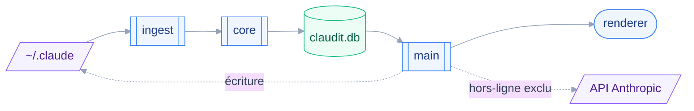

# Architecture

Le dépôt ne contient encore aucun code : tout ce qui suit est décidé et audité, pas implémenté.
Source des décisions : `aidd_docs/INSTALL.md`.

## 🧱 Stack

- TypeScript sur Electron, seul langage maîtrisé — Rust exclu de fait, donc Tauri écarté.
- React et Vite dans le renderer, en SPA : tableau de bord interactif, ni SEO ni rendu serveur.
- Monolithe à noyau isolé, un seul mainteneur et quatre fonctionnalités.
- Node ≥ 22 obligatoire.
- Biome pour le lint et le format, Vitest pour les tests.

Les bibliothèques propres à une capacité — moteur SQLite, empaqueteur — vivent dans le fichier de cette capacité.

## 🔗 Comment les pièces s'emboîtent

Le diagramme montre le trajet d'une donnée, de sa source dans `~/.claude` jusqu'à son affichage.

## ⚖️ Décisions structurantes

### Le noyau ne connaît ni Electron ni le disque

`src/core/` ne contient que du TypeScript pur : parsing, règles d'audit, scoring, calcul de coût.
La frontière est tenue par une règle Biome `noRestrictedImports` sur `src/core/**`, pas par une scission en paquets.

La scission en paquets a été auditée puis écartée : elle n'apporte rien au jour 1 et importe des pannes réelles.
La règle garde ouverte l'option d'un CLI publiable via `bin` et `files`, sans en payer le coût aujourd'hui — le CLI est classé besoin spéculatif.

### L'ingestion vit dans un processus utilitaire

Jamais dans le processus principal.
Ce choix sort l'API SQLite synchrone du fil de l'interface, et il contourne une lacune connue : Vite ne sait pas encore empaqueter un worker Node, la PR amont étant ouverte depuis novembre 2025.

`worker_threads` a été mesuré comme un confort, pas une nécessité : 1,6 Go sont ingérés en 6,46 s en mono-thread.

### Coquille d'abord, chargement paresseux

La coquille doit être interactive en moins de trois secondes, quoi qu'il arrive.
L'indexation tourne en arrière-plan sans jamais bloquer l'interface, et toute vue doit savoir s'afficher dans un état de données partielles.

C'est une contrainte de conception, pas une optimisation à ajouter plus tard.

## ⚠️ Pièges

- `better-sqlite3@13` segfault sous Node 20 : Node ≥ 22 n'est pas un confort, c'est un prérequis.
- Electron doit rester en `devDependencies`, faute de quoi `electron-builder` refuse de construire.
- Le calcul de coût porte sept dimensions ; un simple produit entrée fois prix donne un chiffre faux — voir `integration.md`.
- Chez l'auteur, `~/.claude/agents/`, `rules/` et `skills/` sont vides : les skills et agents réels vivent dans `~/.claude/plugins/`. Le pilier éditer doit couvrir les deux emplacements, sans quoi il n'affiche rien.

## 🔎 Réserves non levées

Ces points sont décidés sans mesure, et attendent le premier jet d'implémentation.

- Le comportement de `node:sqlite` sous charge, sur 1,6 Go, n'a pas été mesuré.
- La syntaxe exacte des `overrides` Biome a été lue dans la documentation, jamais exécutée.
- Le crash DuckDB qui a écarté le candidat B n'a été reproduit que sur macOS arm64 avec Electron 44.
