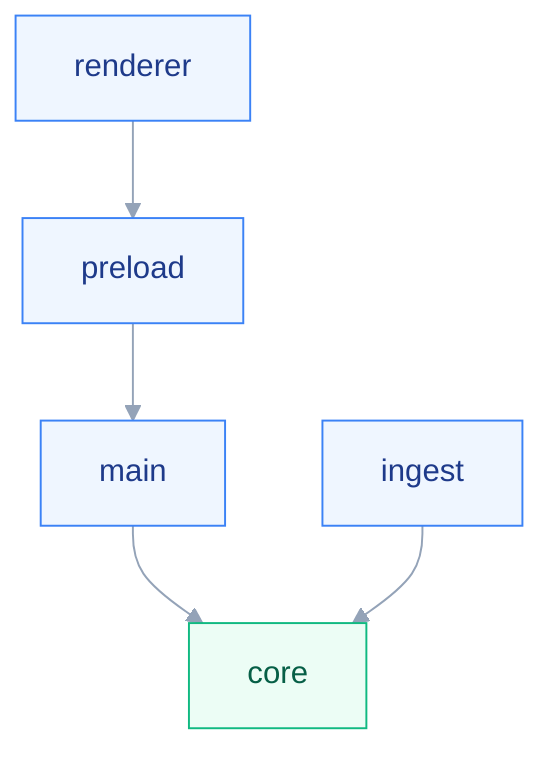

# Carte du code

Aucune de ces zones n'existe encore sur le disque : elles sont décidées, pas créées.
L'arborescence détaillée est dans `aidd_docs/INSTALL.md`, jamais recopiée ici.

## 🗺️ Les zones

Le diagramme montre qui a le droit d'appeler qui.

## 📁 Responsabilités

| Zone | Détient |
| --- | --- |
| `src/core/` | Parsing, tarification, audit, scoring. TypeScript pur, aucun import `electron` ni `node:fs` |
| `src/ingest/` | Processus utilitaire : scan des sources et ingestion en base |
| `src/main/` | Processus principal Electron : base, lecture-écriture de `~/.claude`, appels API, IPC |
| `src/preload/` | Pont exposé au renderer |
| `src/renderer/` | React. Un dossier par pilier sous `features/` |

`src/core/` est la seule zone que personne n'appelle vers le bas : elle ne dépend de rien du projet.
C'est ce qui la rend testable sans lancer Electron — voir `testing.md`.

## 🚪 Points d'entrée

| Fichier | Rôle |
| --- | --- |
| `src/main/index.ts` | Démarrage du processus principal |
| `src/ingest/index.ts` | Démarrage du processus utilitaire |
| `src/preload/index.ts` | Pont contextuel |
| `src/renderer/main.tsx` | Montage React |
