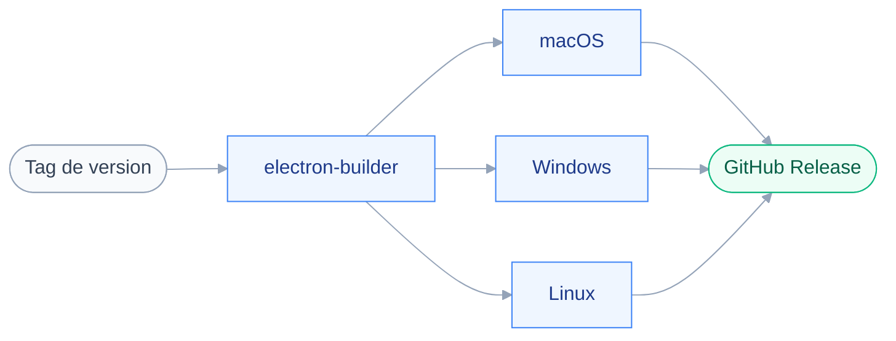

# Livraison

Aucun workflow n'existe : le dépôt n'est pas créé.
Les décisions ci-dessous sont arrêtées et auditées.

## 🚚 Pipeline

GitHub Actions construit les releases, et rien d'autre.
Les tests et le build de vérification tournent en local, contrairement à `louise` qui porte quatre gates en CI.

## 📦 Empaquetage

- `electron-builder` avec `electron-vite`, configuré dans `electron-builder.yml`.
- Electron reste en `devDependencies` : `electron-builder` refuse de construire autrement.

Electron Forge a été écarté : son plugin Vite est estampillé expérimental, et son gabarit reste en Vite 5 — incompatible avec Vitest, qui exige Vite ≥ 6.

## 🚀 Distribution

- GitHub Releases, dépôt public.
- Tap Homebrew personnel, faute de cask officiel.
- Aucune signature de code.

## ⚠️ macOS est bloqué sans signature

Deux verrous indépendants tombent sur la même cause, l'absence de Developer ID.
Homebrew désactive les casks échouant aux contrôles Gatekeeper à partir de septembre 2026, et `Squirrel.Mac` exige une application signée pour la mise à jour automatique, sans exception.

La décision prise est d'assumer l'absence de signature pour l'instant.

| Conséquence | Traitement retenu |
| --- | --- |
| Pas de cask officiel | Tap Homebrew personnel |
| Pas de mise à jour automatique sur macOS | L'application notifie qu'une version existe, elle ne l'installe pas |
| Avertissement Gatekeeper à chaque version | Étape `xattr -dr com.apple.quarantine` documentée pour l'utilisateur |
| Windows | Conserve sa mise à jour automatique, un avertissement SmartScreen près |

Homebrew avait été envisagé comme repli à la mise à jour automatique : le repli est invalide, les deux canaux se ferment ensemble.
Le déblocage coûte 99 $/an via l'Apple Developer Program, à reconsidérer au premier partage large.

## 🌍 Environnements

Aucun. L'application s'exécute sur la machine de l'utilisateur, il n'y a ni serveur ni environnement intermédiaire.
