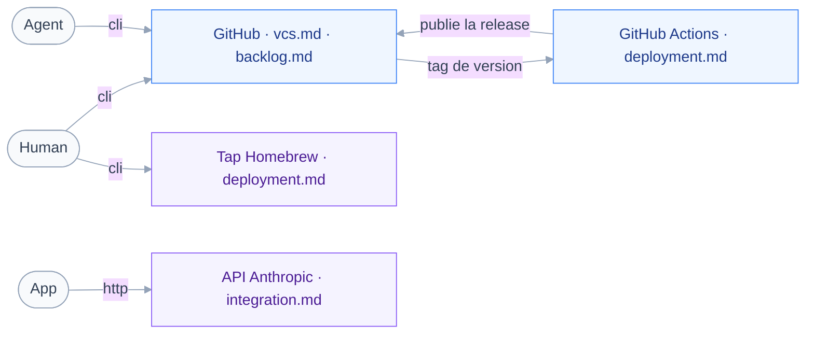

# Écosystème

## 🌐 Qui atteint quoi

Le graphe montre les services extérieurs au dépôt et le mode d'accès de chaque acteur.

```mermaid
%%{init: {'theme':'base','themeVariables':{'fontFamily':'ui-sans-serif, system-ui, sans-serif','lineColor':'#94a3b8','primaryTextColor':'#334155'}}}%%
flowchart LR
    Human([Human])
    Agent([Agent])
    App([App])
    Github["GitHub · vcs.md · backlog.md"]
    Actions["GitHub Actions · deployment.md"]
    Brew["Tap Homebrew · deployment.md"]
    Anthropic["API Anthropic · integration.md"]

    Human -- cli --> Github
    Agent -- cli --> Github
    Human -- cli --> Brew
    App -- http --> Anthropic

    Github -- "tag de version" --> Actions
    Actions -- "publie la release" --> Github

    classDef neutre fill:#f8fafc,stroke:#94a3b8,color:#334155
    classDef bleu fill:#eff6ff,stroke:#3b82f6,color:#1e3a8a
    classDef violet fill:#f5f3ff,stroke:#8b5cf6,color:#4c1d95

    class Human,Agent,App neutre
    class Github,Actions bleu
    class Brew,Anthropic violet
```
