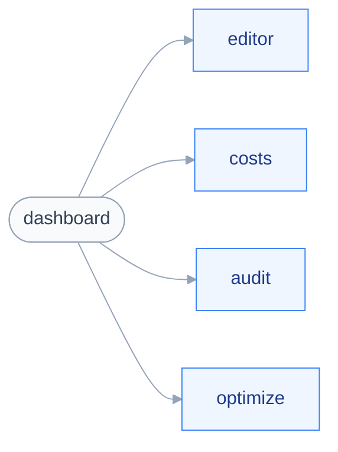

# Navigation

Aucun routeur n'est choisi.
La carte ci-dessous vient du découpage de `src/renderer/features/`, décidé dans `aidd_docs/INSTALL.md`.

## 🗺️ Les sections

Le diagramme montre les cinq zones de l'application, une par dossier de `features/`.

`dashboard` est l'entrée ; les quatre autres sections portent chacune un pilier — éditer, mesurer, auditer, optimiser.

## 🔓 Routes protégées

Aucune. L'application est locale et mono-utilisateur, il n'y a pas d'authentification.

## ❓ Reste à trancher

Le routeur, et la façon dont une section s'affiche pendant que l'indexation est encore en cours.
